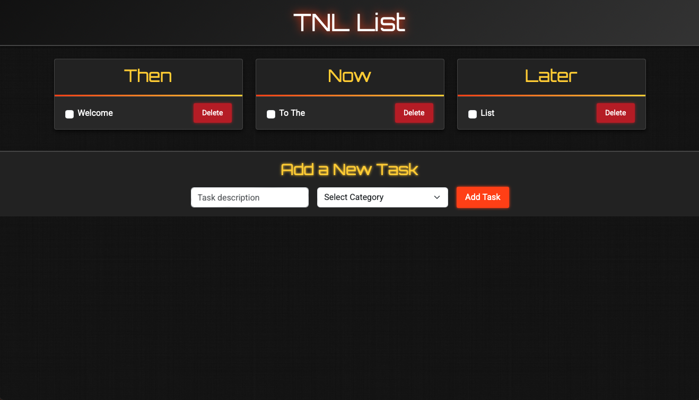

# Then, Now, and Later List

A sleek, high-tech daily task manager inspired by my own workflow. This web app organizes your day into three categories—**Then**, **Now**, and **Later**—helping you prioritize tasks.




## Table of Contents

- [Overview](#overview)
- [Features](#features)
- [Tech Stack](#tech-stack)
- [Installation](#installation)
- [Usage](#usage)
- [Customization](#customization)
- [Contributing](#contributing)
- [License](#license)
- [Acknowledgments](#acknowledgments)

## Overview

**Then, Now, Later List** is a modern, full-stack web application that divides your daily tasks into three categories:
- **Then:** Overdue or missed tasks.
- **Now:** Tasks that need immediate attention.
- **Later:** Tasks scheduled for later in the day.

The app features:
- A dark, metallic background with industrial textures.
- Red and gold accents to evoke sophistication and power.
- Clean, modern typography with subtle glow and hover animations.
- Responsive design using Bootstrap for an optimal experience on any device.

## Features

- **Categorized Task Management:** Easily add, update, and delete tasks in the Then, Now, and Later columns.
- **Modern, Industrial Aesthetic:** A textured, high-tech design.
- **Responsive Layout:** Built with Bootstrap to ensure the app looks great on all devices.
- **Dynamic Interactions:** Subtle animations and hover effects enhance the user experience.
- **Lightweight & Extensible:** A minimal, clean codebase that you can expand with additional features like user authentication, task editing, or notifications.

## Tech Stack

- **Backend:**  
  - Python & Flask
  - SQLAlchemy for ORM

- **Frontend:**  
  - HTML5 & CSS3
  - Bootstrap 5 for responsive design
  - Custom CSS for industrial, high-tech styling
  - Google Fonts (Orbitron & Roboto)

- **Optional:**  
  - JavaScript for AJAX form submissions and additional dynamic effects

## Installation

1. **Clone the repository:**

   ```bash
   git clone https://github.com/jyounes23/ThenNowLater.git
   cd ThenNowLater

	2.	Create a virtual environment and activate it:

python3 -m venv venv
source venv/bin/activate   # On Windows use: venv\Scripts\activate


	3.	Install dependencies:

pip install -r requirements.txt


	4.	Run the application:

python app.py


	5.	Open your browser and navigate to:

http://127.0.0.1:5000/


## Usage

- **Add Tasks:**  
  Use the form at the bottom of the page to add new tasks. Choose the appropriate category (Then, Now, or Later) for each task.

- **Update Tasks:**  
  Mark tasks as completed by clicking the checkbox next to each task.

- **Delete Tasks:**  
  Remove tasks by clicking the delete button associated with each task.

## Customization

- **Styling:**  
  The custom CSS file (`static/style.css`) contains all the styling rules. You can adjust colors, fonts, animations, and textures to further tailor the look and feel to your liking.

- **Fonts & Colors:**  
  The design uses Google Fonts for a futuristic look. Modify the `@import` URLs or CSS rules to experiment with different fonts or color schemes.

- **Additional Features:**  
  Enhance the app by integrating new features such as user authentication, drag-and-drop task ordering, or real-time notifications.

## Contributing

Contributions are welcome! If you’d like to enhance the project, please do so!

## License

This project is licensed under the MIT License. 

## Acknowledgements

- **Design Inspiration:**  
  Inspired by Iron Man’s high-tech workshop.

- **Bootstrap & Google Fonts:**  
  For making it easy to build responsive, modern designs.


-----------------

Enjoy managing your tasks!
